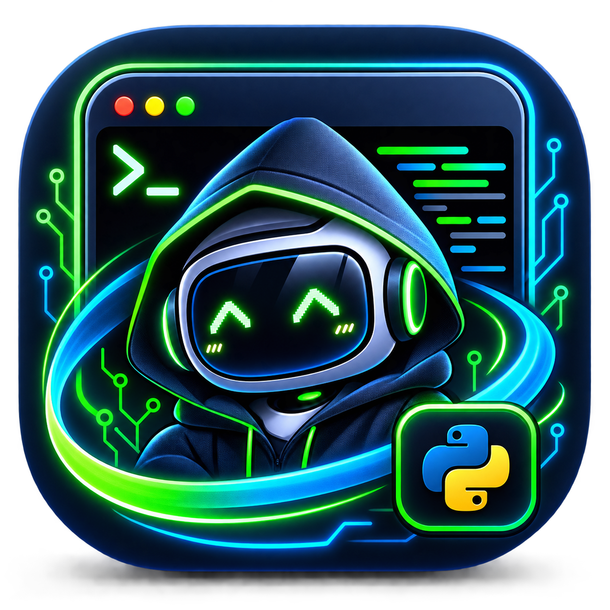

<p align="center">
  
</p>

<h1 align="center">chanthecno</h1>

<p align="center">
  <strong>Aplikasi desktop chat AI open-source</strong> — bawa API key sendiri, tanpa akun, tanpa perantara, dan tanpa biaya langganan.
</p>

<p align="center">
  <a href="../../releases"></a>
  <a href="../../actions"></a>
  
  
  
</p>

<p align="center">
  🌐 <a href="https://chanthecno.biz.id"><strong>chanthecno.biz.id</strong></a>
  &nbsp;·&nbsp;
  📦 <a href="../../releases">Download</a>
  &nbsp;·&nbsp;
  🐛 <a href="../../issues">Lapor Bug / Request Fitur</a>
</p>

---

## Apa itu chanthecno?

**chanthecno** adalah aplikasi desktop open-source untuk chat dengan AI, di mana pengguna **membawa API key sendiri** (*bring your own key* / BYOK) dari provider pilihan — **Claude (Anthropic)**, **Gemini (Google)**, **GPT (OpenAI)**, atau **endpoint OpenAI-compatible apa pun** seperti **Groq**.

Berbeda dari layanan chat AI berbayar berbasis langganan, chanthecno **tidak punya server perantara**. Setiap permintaan dikirim **langsung dari perangkat pengguna ke provider AI** — tidak ada akun, tidak ada login, dan tidak ada biaya tambahan di luar biaya API yang dipakai.

> Cocok untuk: developer yang ingin akses cepat ke banyak model AI dalam satu aplikasi ringan, tanpa terkunci ke satu provider, dan tanpa mengorbankan privasi data percakapan.

## Kenapa memilih chanthecno

| | chanthecno | Aplikasi chat AI berlangganan |
|---|---|---|
| Model bisnis | Gratis, open-source (MIT) | Berbayar per bulan |
| API key | Milik pengguna sendiri | Terkunci ke satu vendor |
| Privasi data | Langsung ke provider, tanpa perantara | Melewati server pihak ketiga |
| Multi-provider | Claude, Gemini, GPT, Groq, custom endpoint | Biasanya satu model saja |
| Ukuran aplikasi | Ringan (Tauri + Rust, bukan Electron) | Bervariasi, sering berat |
| Kode sumber | Terbuka & bisa diaudit | Tertutup |

## Fitur utama

- 🔐 **100% lokal** — API key tersimpan di perangkat pengguna, tidak pernah dikirim ke server chanthecno
- 🔄 **Multi-provider** — mendukung Claude, Gemini, GPT, dan endpoint OpenAI-compatible seperti Groq
- ⚡ **Cepat & ringan** — dibangun dengan Tauri + Rust, bukan Electron, sehingga hemat RAM dan resource
- 🛡️ **Backup terenkripsi (opsional)** — cadangkan API key ke VPS pribadi dengan enkripsi AES-256-GCM
- 🖥️ **Cross-platform** — tersedia untuk Windows dan Linux, dengan installer siap pakai
- 📖 **Open source** — lisensi MIT, kode transparan dan dapat diaudit siapa saja

## Struktur proyek

```
chanthecno/
├── dist/                   # Frontend (HTML/CSS/JS) — tampilan jendela aplikasi
├── src-tauri/               # Shell desktop (Rust + Tauri)
├── server/                   # Backend VPS OPSIONAL — backup API key terenkripsi
└── .github/workflows/        # Build otomatis installer Windows & Linux
```

## Daftar isi

- [Provider yang didukung](#provider-yang-didukung)
- [Menjalankan mode development](#menjalankan-mode-development)
- [Install lewat GitHub Release](#install-lewat-github-release-tanpa-build-sendiri)
- [Build installer sendiri](#build-installer-sendiri-windows-msiexe-linux-debappimage)
- [Deploy backend ke VPS](#deploy-backend-ke-vps)
- [Kenapa arsitekturnya begini](#kenapa-arsitekturnya-begini)
- [Pertanyaan yang sering ditanyakan (FAQ)](#pertanyaan-yang-sering-ditanyakan-faq)
- [Roadmap](#roadmap-yang-masuk-akal)
- [Kontribusi](#kontribusi)

## Provider yang didukung

Selain **Claude (Anthropic)**, **OpenAI**, dan **Google Gemini** secara native, chanthecno juga bisa disambungkan ke **endpoint custom** apa pun yang OpenAI-compatible — termasuk [**Groq**](https://console.groq.com/keys) (gratis & cepat untuk eksperimen).

Untuk provider custom, isi kolom berikut di aplikasi:

| Field | Isi |
|---|---|
| Endpoint | `https://api.groq.com/openai/v1/chat/completions` |
| API Key | key dari console provider terkait |
| Model | cek daftar model aktif via `GET /v1/models` di provider tersebut |

## Menjalankan mode development

### Prasyarat

- [Node.js](https://nodejs.org) 18+
- [Rust](https://rustup.rs)
- Tauri CLI: `cargo install tauri-cli`
- Linux (Debian/Ubuntu/Linux Mint): paket dev GTK & WebKit —

  ```bash
  sudo apt install -y libwebkit2gtk-4.1-dev build-essential curl wget file \
    libxdo-dev libssl-dev libayatana-appindicator3-dev librsvg2-dev \
    libgtk-3-dev pkg-config
  ```

  (lihat juga [prasyarat resmi Tauri](https://tauri.app/start/prerequisites/))

### Jalankan aplikasi desktop

```bash
cargo tauri dev
```

Perintah ini membuka jendela aplikasi langsung dari folder `dist/` — tidak perlu bundler tambahan karena frontend-nya vanilla HTML/CSS/JS.

### Jalankan backend (opsional, untuk menguji fitur backup)

```bash
cd server
cp .env.example .env      # lalu isi MASTER_KEY dengan: openssl rand -hex 32
npm install
npm run dev
```

Server berjalan di `http://localhost:3000`. Isi URL tersebut di kolom "Backup" pada aplikasi untuk menguji — **bukan** untuk dibuka langsung di browser, karena ini API polos tanpa halaman UI.

## Install lewat GitHub Release (tanpa build sendiri)

Cara paling mudah bagi siapa pun yang ingin langsung *memakai*, bukan mengembangkan:

1. Buka tab [**Releases**](../../releases)
2. Unduh installer sesuai sistem operasi:
   - **Debian/Ubuntu/Linux Mint** → `.deb`
   - **Fedora/RHEL-based** → `.rpm`
   - **Distro apa pun (tanpa instalasi)** → `.AppImage`
   - **Windows** → `.msi` atau `.exe`
3. Instal dan buka seperti aplikasi biasa

## Build installer sendiri (Windows .msi/.exe, Linux .deb/.AppImage)

Cara paling mudah lewat **GitHub Actions** (sudah disiapkan di `.github/workflows/build.yml`) — tidak perlu instalasi toolchain Windows di Linux:

1. Push proyek ini ke GitHub
2. Buat tag versi: `git tag v0.1.0 && git push origin v0.1.0`
3. Actions otomatis build untuk Linux & Windows, lalu membuat **Draft Release** berisi installer
4. Review draft-nya di tab "Releases", lalu publish

> Build Linux dijalankan di runner `ubuntu-22.04` (bukan `ubuntu-latest`) agar binary yang dihasilkan tetap kompatibel dengan sistem yang GLIBC-nya lebih lama, seperti Linux Mint 21.x.

Build manual (untuk mencoba di komputer sendiri):

```bash
cargo tauri build
```

Hasilnya ada di `src-tauri/target/release/bundle/`.

## Deploy backend ke VPS

1. `git clone` repo ini di VPS, masuk ke folder `server/`
2. `cp .env.example .env`, isi `MASTER_KEY` acak & rahasia
3. `npm install --production`
4. Jalankan dengan process manager:

   ```bash
   npm install -g pm2
   pm2 start server.js --name chanthecno
   ```

5. Pasang reverse proxy + SSL gratis (Nginx + Certbot) agar diakses via `https://` — API key **jangan pernah** dikirim lewat HTTP biasa
6. `data.json` di folder `server/` adalah "database" sederhana — cukup untuk tahap dev; jika pengguna makin banyak, ganti ke SQLite/Postgres

## Kenapa arsitekturnya begini

- **Default: 100% lokal.** API key disimpan di `localStorage` milik aplikasi di komputer pengguna, dan panggilan ke provider (Claude/Gemini/OpenAI/Groq/dll) langsung dari aplikasi ke provider. Server chanthecno tidak pernah menyentuh isi obrolan.
- **Backup ke VPS itu opsional**, dipicu manual lewat tombol "Cadangkan". Pengguna diidentifikasi lewat `deviceId` acak (UUID) yang dibuat otomatis saat pertama kali memakai aplikasi — bukan akun/password. Simpel, tapi tetap personal per-instalasi.
- API key yang di-backup **dienkripsi (AES-256-GCM)** di server sebelum ditulis ke disk, menggunakan `MASTER_KEY` yang hanya dipegang oleh pemilik server.

> ⚠️ **Tanggung jawab keamanan**: begitu ada satu pengguna memakai fitur backup, pemilik server memegang API key asli mereka (walau terenkripsi saat disimpan). Jaga `MASTER_KEY` di luar repo, gunakan HTTPS di VPS, dan pertimbangkan fitur "hapus data saya" untuk pengguna yang ingin berhenti memakai backup.

## Pertanyaan yang sering ditanyakan (FAQ)

**Apakah chanthecno gratis?**
Ya. chanthecno berlisensi MIT dan gratis digunakan. Biaya yang mungkin timbul hanya dari pemakaian API provider AI pilihan pengguna (beberapa provider seperti Groq punya tier gratis).

**Apakah chanthecno menyimpan percakapan saya di server?**
Tidak. Secara default semua data — termasuk API key dan riwayat chat — disimpan lokal di perangkat pengguna. Permintaan dikirim langsung dari aplikasi ke provider AI, tanpa melalui server chanthecno.

**Provider AI apa saja yang didukung chanthecno?**
Claude (Anthropic), Gemini (Google), GPT (OpenAI), dan endpoint apa pun yang kompatibel dengan format API OpenAI, termasuk Groq.

**Apakah chanthecno tersedia untuk macOS?**
Belum. Saat ini chanthecno tersedia untuk Windows dan Linux; dukungan macOS ada di roadmap.

**Apa bedanya chanthecno dengan ChatGPT Desktop atau Claude Desktop resmi?**
Aplikasi resmi biasanya terkunci ke satu provider dan mengharuskan akun/langganan. chanthecno bersifat multi-provider, tanpa akun, dan pengguna membawa API key sendiri sehingga biaya sepenuhnya transparan sesuai pemakaian.

## Roadmap yang masuk akal

- [ ] Riwayat chat tersimpan lokal antar sesi (sudah otomatis via `localStorage`, tinggal ditambah UI daftar percakapan)
- [ ] Export/import riwayat chat sebagai file
- [ ] Auto-update lewat Tauri updater
- [ ] Ganti `data.json` di backend ke SQLite jika pengguna mulai banyak
- [ ] UI untuk mengatur system prompt/persona AI tanpa edit kode
- [ ] Build Windows yang stabil di GitHub Actions
- [ ] Dukungan macOS

## Kontribusi

Pull request, laporan bug, dan ide fitur sangat diterima. Silakan buka [Issues](../../issues) untuk melapor bug atau mengusulkan fitur, atau langsung ajukan Pull Request.

## Lisensi

Proyek ini berlisensi [MIT](../../blob/main/LICENSE) — bebas digunakan, dimodifikasi, dan didistribusikan ulang dengan tetap mencantumkan atribusi.

---

<p align="center">
  Dibuat oleh <strong><a href="https://github.com/candripanjaitan16">Candri</a></strong> — self-taught programmer dari Indonesia yang passionate tentang AI security dan open-source development.
</p>

<p align="center">
  <sub>Kata kunci: aplikasi chat AI desktop, chat AI bawa API key sendiri, alternatif ChatGPT desktop open source, Tauri Rust AI chat client, aplikasi Claude Gemini GPT Groq satu aplikasi.</sub>
</p>